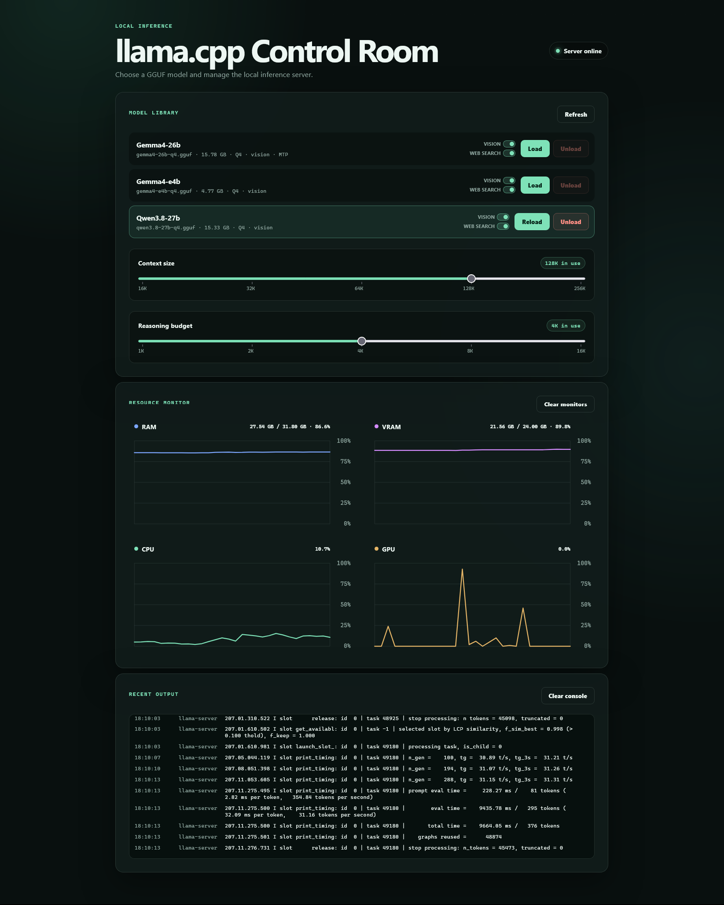

# llama.cpp Windows Web Manager



A Windows tray application that runs [llama.cpp](https://github.com/ggml-org/llama.cpp)
`llama-server` behind a management web UI, with Caddy as the reverse proxy and an
optional free Cloudflare Tunnel for public access.

## Features

- **Model manager** – load, stop, and restart GGUF models from a web UI, with
  automatic pairing of MTP draft models and multimodal projection (`mmproj`) files.
- **Flexible context sizes** – choose from context sizes generated between
  `LLAMA_MIN_CONTEXT_SIZE` and `LLAMA_MAX_CONTEXT_SIZE` (power-of-two steps).
- **Performance tuning** – flash attention, quantized KV cache, and KV-cache
  reuse (`--cache-reuse N`) are configurable from `.env`.
- **Built-in web research** – an optional agentic web-search tool backed by
  DuckDuckGo and safe, public-only URL fetching.
- **Reverse proxy** – Caddy exposes llama.cpp (`/8080/`) and the management UI
  (`/8081/`) on a single port.
- **Public access** – optional Cloudflare Tunnel (`cloudflared`) exposes your
  localhost on the public web for free.
- **System tray** – starts minimized, clean shutdown of every child process.

## Architecture

Everything runs from a single entry point, `app.py`:

```text
                    ┌─────────────────────────────────────────────┐
                    │                  app.py                     │
                    │                                             │
  llama-server ─────┤  model process (0.0.0.0:8080)               │
                    │  management UI (Waitress/Flask 0.0.0.0:8081)│
                    │  reverse proxy  (Caddy 0.0.0.0:8082)        │
                    │  public tunnel  (cloudflared, optional)     │
                    └─────────────────────────────────────────────┘
```

- `llama-server` on `0.0.0.0:8080` – the model inference server, spawned only
  when you load a model from the UI.
- Waitress/Flask on `0.0.0.0:8081` – the management web UI and REST API.
- Caddy on `0.0.0.0:8082` – single entry point; `/8080/` proxies to llama.cpp,
  `/8081/` to the management UI.
- `cloudflared` – started only when `ENABLE_CLOUDFLARE_TUNNEL=true`, forwarding
  a public hostname to Caddy.

When the Cloudflare Tunnel is enabled the public routes are:

```text
{CLOUDFLARE_TUNNEL_URL}/8080/  -> llama.cpp
{CLOUDFLARE_TUNNEL_URL}/8081/  -> management UI
```

## Requirements

- Windows with **Python 3.11+** (`py -3.11` in the instructions below).
- `llama-server.exe` (from a llama.cpp release, e.g. CUDA build).
- `caddy.exe` (single static binary from <https://caddyserver.com/download>).
- `cloudflared.exe` – only if you want the public tunnel.
- A `models` folder containing GGUF files.

## Windows setup

Open PowerShell in the project directory:

```powershell
Set-Location "C:\Users\%LOCALAPPDATA%\OneDrive\Documents\llama.cpp Windows Web Manager"
```

Create the virtual environment and install dependencies:

```powershell
py -3.11 -m venv .venv
Set-ExecutionPolicy -Scope Process -ExecutionPolicy Bypass
.\.venv\Scripts\Activate.ps1
python -m pip install -r .\requirements.txt
```

Copy `.env.example` to `.env` and adjust the paths and options for your machine
(the checked-in `.env` is ignored by git and already configured for this PC).

## Running

Start the entire stack with one command:

```powershell
.\.venv\Scripts\python.exe .\app.py
```

On Windows this starts a notification-area icon:

- **Double-click** – open the settings page.
- **Right-click** – open Settings, open the llama.cpp UI, or choose **Exit**.
- **Exit** cleanly stops Waitress, Caddy, the Cloudflare Tunnel (when enabled),
  and any llama-server process loaded by the UI.

To start minimized without a PowerShell window (e.g. from a desktop or
Startup-folder shortcut):

```powershell
Start-Process .\.venv\Scripts\pythonw.exe -ArgumentList ".\app.py" -WorkingDirectory "C:\Users\%LOCALAPPDATA%\OneDrive\Documents\llama.cpp Windows Web Manager"
```

When launched with `pythonw.exe`, always stop the application from the tray
icon's **Exit** command.

For console-only operation without a tray icon:

```powershell
.\.venv\Scripts\python.exe .\app.py --no-tray
```

In console-only mode, `Ctrl+C` performs the same clean shutdown.

### Process and log behavior

Child executables are started with `CREATE_NO_WINDOW` (no console windows). Caddy
and an enabled Cloudflare Tunnel write their output to nowhere; llama-server
output is kept only in bounded in-memory buffers for the website console. It is
never printed by `app.py` and never written to a log file. The startup URL
announcements are printed only when a console is present.

## Public access with Cloudflare Tunnel

The tunnel is free, needs no inbound firewall port, and is disabled by default:

```dotenv
ENABLE_CLOUDFLARE_TUNNEL=false
```

### Named tunnel (recommended, fixed hostname)

1. Create a tunnel in the Cloudflare Zero Trust dashboard
   (<https://one.dash.cloudflare.com> → Networks → Tunnels).
2. On the tunnel's overview page choose **Add a replica** to reveal the
   installation command, and copy the `eyJ...` token.
3. Configure a public hostname for the tunnel pointing to
   `http://localhost:{CADDY_PORT}` (8082 by default).
4. Set these in `.env`:

   ```dotenv
   ENABLE_CLOUDFLARE_TUNNEL=true
   CLOUDFLARE_TUNNEL_URL=https://your-hostname.example.com
   CLOUDFLARE_TUNNEL_TOKEN=your_eyJ_token
   ```

`cloudflared.exe` is resolved from `CLOUDFLARE_TUNNEL_PATH`, the project
directory, or `PATH`. The token is passed to `cloudflared` through the
`TUNNEL_TOKEN` environment variable, so it never appears in the process command
line. Never publish the token.

### Quick tunnel (no account, random URL)

If you just want to test public access without an account, install `cloudflared`
and run it manually alongside the manager:

```powershell
cloudflared tunnel --url http://127.0.0.1:8082
```

It prints a random `https://*.trycloudflare.com` URL. Any hostname-based
tunneling needs Caddy running, so keep `app.py` running too. This mode is not
launched by `app.py`; it is a manual alternative to the named tunnel.

## Model management

### File naming conventions

Files containing `mmproj` are hidden from the model list. A matching projection
file is attached automatically. The `mmproj` filename is derived from the model
name without the quantization token, so a model named `model-name-q4-mtp.gguf`
looks for `model-name-mtp-mmproj.gguf`.

Display names remove both the internal `-mtp` marker and any `-q<number>`
quantization token, while the original filename remains available for applying
MTP launch options. The quantization is shown separately in the model list in
uppercase after the file size, for example
`model-name-q4-mtp.gguf · 21.11 GB · Q4`.

### MTP (multi-token prediction)

MTP can come from two sources:

- **Single file** – the main GGUF itself contains the MTP head and no matching
  draft exists (a name like `model-name-q4-mtp.gguf` on its own). The manager
  launches it with `--spec-type draft-mtp --spec-draft-n-max`.
- **Separate draft file** – the draft shares the same base name as the main
  model but without the quantization token, e.g. main `model-name-q4.gguf`
  paired with `model-name-mtp.gguf`. The `-mtp` file is recognized as a draft,
  hidden from the model list, and the main card launches with
  `--model-draft model-name-mtp.gguf` followed by the same `--spec-type` flags.

In both cases the model card shows the `MTP` feature badge.

## Web search and research agent

When web search is enabled for a session, the management UI adds an
agentic-search chat. llama-server receives an MCP server configuration
(`web_search.py`) that:

- runs searches through DuckDuckGo (via the `ddgs` package),
- fetches and extracts readable text and links from public URLs,
- blocks access to localhost/private addresses and validates all redirects,
- caps fetched content (`WEB_FETCH_MAX_CHARS`) and search turns
  (`WEB_SEARCH_MAX_TURNS`).

Enable it per session from the UI, or pass `"web_search": true` in the API.
Web search uses DuckDuckGo (`ddgs`) by default, so no separate search engine
needs to be installed or configured.

## Configuration reference

`app.py` reads these values from `.env`. Settings without a "default" are
required and will fail startup if missing.

| Variable | Default | Purpose |
|---|---|---|
| `FRONTEND_DIR` | `<project>/frontend` | Static frontend directory |
| `MODELS_DIR` | `<project>/models` | Directory scanned for GGUF models |
| `LLAMA_SERVER_PATH` | `<project>/llama-server.exe` | llama-server executable |
| `LLAMA_HOST` | `0.0.0.0` | llama-server bind host |
| `LLAMA_PORT` | `8080` | llama-server bind port |
| `LLAMA_DEFAULT_CONTEXT_SIZE` | – | Default context size shown in the UI |
| `LLAMA_MIN_CONTEXT_SIZE` | `16384` | Smallest selectable context size |
| `LLAMA_MAX_CONTEXT_SIZE` | `131072` | Largest selectable context size |
| `LLAMA_ALIAS` | – | Model alias passed as `--alias` |
| `LLAMA_MTP_SPEC_TYPE` | – | Spec type for MTP, e.g. `draft-mtp` |
| `LLAMA_MTP_DRAFT_N_MAX` | – | `--spec-draft-n-max` value |
| `LLAMA_NO_MMPROJ_OFFLOAD` | – | Adds `--no-mmproj-offload` when `true` |
| `LLAMA_FLASH_ATTN` | `false` | Adds `--flash-attn` when `true` |
| `LLAMA_KV_CACHE_QUANTIZATION` | `off` | `4`, `8`, or `off`; maps to `--cache-type-k/v` |
| `LLAMA_CACHE_REUSE` | `0` | Adds `--cache-reuse N`; `0` omits the flag |
| `LLAMA_CORS_ORIGINS` | *(empty)* | Adds `--cors-origins <value>`; empty keeps llama-server's default |
| `WEB_LOG_LINES` | – | Max in-memory console lines kept for the website |
| `TRAY_ENABLED` | – | Show the notification-area icon when `true` |
| `TRAY_TOOLTIP` | – | Tray icon tooltip text |
| `FLASK_HOST` | – | Management UI bind host |
| `FLASK_PORT` | – | Management UI bind port |
| `CADDY_PATH` | `<project>/caddy.exe` | Caddy executable |
| `CADDYFILE_PATH` | `<project>/Caddyfile` | Caddy configuration |
| `CADDY_PORT` | `8082` | Caddy bind port |
| `ENABLE_CLOUDFLARE_TUNNEL` | `false` | Start `cloudflared tunnel run` when `true` |
| `CLOUDFLARE_TUNNEL_PATH` | *(auto)* | Path to `cloudflared.exe` |
| `CLOUDFLARE_TUNNEL_URL` | *(empty)* | Public base URL, e.g. `https://llm.example.com` |
| `CLOUDFLARE_TUNNEL_TOKEN` | *(empty)* | Remote tunnel token (`eyJ...`) |
| `WEB_SEARCH_MAX_RESULTS` | `5` | Max results per search (1–20) |
| `WEB_SEARCH_TIMEOUT` | `15` | Per-request timeout in seconds (1–120) |
| `WEB_FETCH_MAX_CHARS` | `30000` | Max characters extracted per URL (2000–100000) |
| `WEB_SEARCH_MAX_TURNS` | `15` | Max agentic search turns (2–50) |

Caddy also reads the host and port variables from the environment passed by
`app.py`, so ports must match between the Caddyfile and `.env`.

### How the llama-server command is built

`app.py` builds an argument list (never a shell string) from the selected model
plus these settings:

```text
llama-server -m <model> [-c <context>]
  [--flash-attn]                     when LLAMA_FLASH_ATTN=true
  [--cache-type-k/v q4_0|q8_0]       when LLAMA_KV_CACHE_QUANTIZATION is 4/8
  --reasoning off --reasoning-budget 0
  [--cache-reuse N]                  when LLAMA_CACHE_REUSE>0
  --alias <alias>
  [--cors-origins <origins>]         when LLAMA_CORS_ORIGINS is set
  --host 0.0.0.0 --port 8080
  [--model-draft <draft>]            when an MTP draft file exists
  [--spec-type draft-mtp --spec-draft-n-max N]
  [--jinja --ui-mcp-proxy --mcp-servers-json ... --ui-config ...]  when web search enabled
```

## API

All requests and responses are JSON. Status codes: `200` on success, `400` for
bad input, `409` for runtime conflicts, `413` for oversized bodies, `500` for
unexpected errors.

| Method | Route | Purpose |
|---|---|---|
| `GET` | `/health` | Liveness probe |
| `GET` | `/api/models` | List loadable models |
| `GET` | `/api/status` | Current model process state |
| `POST` | `/api/start` | Load or reload with `model`, optional `context_size`, `load_mmproj`, `web_search` |
| `POST` | `/api/stop` | Unload the current model |
| `POST` | `/api/restart` | Restart with optional `context_size`, `load_mmproj`, `web_search` |
| `GET` | `/api/command?model=name.gguf&context_size=16384&load_mmproj=true&web_search=false` | Safe command preview |
| `GET` | `/api/metrics` | CPU, RAM, GPU, and VRAM sample |
| `GET` | `/api/logs?limit=120` | Recent in-memory llama-server output |
| `POST` | `/api/logs/clear` | Clear the website console |

All process commands use argument lists, `shell=False`, validated model
filenames, and absolute paths.

## Troubleshooting

- **`(CORS) skip non-localhost origin: http://192.168.x.x:8080`** – llama-server
  is rejecting browser origins that are not `localhost`. Set
  `LLAMA_CORS_ORIGINS` to the exact origin, e.g.
  `http://192.168.100.9:8080`, or to `*` to allow any origin. Prefer a specific
  origin on untrusted networks.
- **`--cors-origins *` security warning** – llama-server warns when CORS allows
  all origins without an API key. For LAN or public use, either restrict
  `LLAMA_CORS_ORIGINS` to a specific origin or set an API key on llama-server.
- **Tunnel does not connect** – make sure `CLOUDFLARE_TUNNEL_TOKEN` is the full
  `eyJ...` token from the dashboard, the tunnel's public hostname points to
  `http://localhost:8082`, and `cloudflared.exe` is found.
- **Port conflicts** – llama-server, Flask, and Caddy use 8080, 8081, and 8082.
  Change them together in `.env` and keep `CADDY_PORT` aligned with the tunnel's
  public hostname target.
- **Model not listed** – verify the file is a `.gguf` under `MODELS_DIR` and is
  not a `-mtp` draft or `-mmproj` projection file (those are intentionally
  hidden and attached to their main model).

## Security notes

- Never publish `CLOUDFLARE_TUNNEL_TOKEN` or any credentials stored in `.env`.
- `fetch_url` blocks local and private-network addresses by design.
- Responses include `Cache-Control: no-store`, `X-Content-Type-Options: nosniff`,
  `X-Frame-Options: DENY`, and `Referrer-Policy: same-origin`.
- When exposing llama-server publicly, consider restricting
  `LLAMA_CORS_ORIGINS` and enabling an API key.
